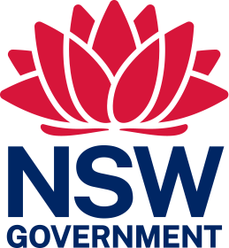

# NSW Design System 

[](https://badge.fury.io/js/nsw-design-system)
[](https://www.jsdelivr.com/package/npm/nsw-design-system)
[](https://percy.io/b183fe4d/nsw-design-system)

The NSW Design System utilises a collection of reuseable components and provides guidance on implementation in accordance with standards and best practices.

Following the NSW Government Brand Framework, the NSW Design System will assist you to apply the NSW Government brand.

View documentation for [NSW Design System](https://digitalnsw.github.io/nsw-design-system/).

## Using the design system

How you use the NSW Design System depends on your team's capabilities. We recommend using `npm` but also provided in a CDN, and a downloadable starter kit which includes all the compiled assets.

 1. [Installing with NPM](#installing-with-npm)
 2. [Import styles](#importing-all-styles)
 3. [Adding the font and icons](#adding-the-font-and-the-icons)
 4. [Importing javascript into your project](#importing-javascript-into-your-project)
 5. [Using JSDelivr CDN](#using-jsdelivr-cdn)

### Installing with Node Version Manager (NVM)
We recommend using [NVM](https://github.com/nvm-sh/nvm) to install dependancies for its node version flexibility.

Windows Users
Please follow this guide [nvm windows](https://github.com/coreybutler/nvm-windows). It contains installation file and a visual tutorial.

Linux & Mac Users
1. Download and install NVM
    ```
    curl -o- https://raw.githubusercontent.com/nvm-sh/nvm/v0.39.1/install.sh | bash
    ```

    Update your profile configuration
    The installation process from step 1 should also automatically add the nvm configuration to your profile. If you're using zsh, that would be ~/.zshrc. If you're using bash, that would be ~/.bash_profile...or some other profile.

    If it doesn't automatically add nvm configuration, you can programmatically load it yourself to your profile file:

    ```
    export NVM_DIR="$([ -z "${XDG_CONFIG_HOME-}" ] && printf %s "${HOME}/.nvm" || printf %s "${XDG_CONFIG_HOME}/nvm")"
    [ -s "$NVM_DIR/nvm.sh" ] && \. "$NVM_DIR/nvm.sh"
    ```

    Reload the shell configuration
    With your profile configuration updated, now you will reload the configuration for your terminal to use:

    ```
    source ~/.bashrc
    ```

    verify nvm is installed by running:
    ```
    nvm -v


    ```
<br>

2. Install and use recommended node version
  ```
  nvm install 10.23
  nvm use 10.23
  ```

  The latest node version compatible with this codebase is 14.0.0
  <br/>

3.  Add  `nsw-design-system` to your project’s `package.json`:
    - `npm install --save nsw-design-system`

The NSW Design System is now installed as a dependancy of your project, check out how to [import styles](#importing-styles-into-your-project) and [javascript](#importing-javascript-into-your-project) in to your project build.

***

### Importing styles
#### All styles
To import all styles as a single package you need to add following snippet at the start of your main SCSS file:
```css
@import 'node_modules/nsw-design-system/src/main';
```
***

#### Core and selected components
Our core library includes the design system's base theme, typography, mixins and helper functions. Once you imported it, you can take full advantage of our variables and helpers. To import core library you need to add following snippet at the start of your main SASS file:

```css
// Core libraries
@import 'node_modules/nsw-design-system/src/global/scss/settings/settings';
@import 'node_modules/nsw-design-system/src/global/scss/base/all';
@import 'node_modules/nsw-design-system/src/global/scss/helpers/all';
@import 'node_modules/nsw-design-system/src/global/scss/settings/palette';
@import 'node_modules/nsw-design-system/src/global/scss/settings/theme';
@import 'node_modules/nsw-design-system/src/core/all';

```

Once you have installed the core library you can start importing components as you need it. To import individual components you need to add following snippets to your main SASS file under core libraries import:

```css
// Components
@import 'node_modules/nsw-design-system/src/components/accordion/accordion';
@import 'node_modules/nsw-design-system/src/components/card/card';
@import 'node_modules/nsw-design-system/src/components/notification/notification';
```

Component examples include rendered component variants and code snippets. Click [here](https://digitalnsw.github.io/nsw-design-system/components/accordion/index.html) to view all component examples.

With this setup you can also start theming with a few sets of variable changes.

***
#### Adding the font and the icons
In your main html document add this line of code inside the `<head>` tag. Make sure that it's placed before the NSW Design System styles import.
```html
  <link href="https://fonts.googleapis.com/css2?family=Public+Sans:ital,wght@0,400;0,700;1,400&display=swap" rel="stylesheet">
  <link href="https://fonts.googleapis.com/icon?family=Material+Icons" rel="stylesheet">
```
Another way is to import it in css:
```css
@import url('https://fonts.googleapis.com/css2?family=Public+Sans:ital,wght@0,400;0,700;1,400&display=swap');
@import url('https://fonts.googleapis.com/icon?family=Material+Icons');

***

```
### Importing javascript into your project
Some NSW Design System components require javascript to provide advanced functionality. To ensure the page is ready for javascript to run, include the follow scripts tags at the end of the html document.
```html
    <script src="path/to/main.js"></script>
    <script>window.NSW.initSite()</script>
  </body>
</html>
```
Depending on your project set up, you might wish to copy the file into your project from `node_modules` or add the reference to your build workflow.

***

### Using JSDelivr CDN
The bundled css and js files are also hosted in [JSDelivr](https://www.jsdelivr.com).

You can add the files to your main html document
```html
<html>
  <head>
    ...
    <link rel="stylesheet" href="https://cdn.jsdelivr.net/npm/nsw-design-system@3/dist/css/main.css">
  </head>
  <body>
    ...
    <script src="https://cdn.jsdelivr.net/npm/nsw-design-system@3/dist/js/main.min.js"></script>
    <script>window.NSW.initSite()</script>
  </body>
</html>
```

***

## Design System Figma UI kit
Access all the design assets required to design, share and prototype in our [Figma UI Kit](https://digitalnsw.github.io/nsw-design-system/docs/content/design/figma-ui-kit.html).


## Versioning
We are using semantic versioning so our version number are increments of MAJOR.MINOR.PATCH where:
- MAJOR version used for incompatible global changes
- MINOR version used for large backwards-compatible updates and release of new components
- PATCH version used for small backwards-compatible updates, new component variations and bug fixes

## Troubleshooting Percy Snapshots
[@percy/cli ](https://docs.percy.io/docs/cli-snapshot) visual regression testing package is using new SDKs which requires a version of node version that is imcompatible with our codebase. Please follow these steps to resolve the dependnacy issue untill we release our new build boilerplate.

1. copy env-sample to .env 
2. add percy api token that is generated when you create new project online [percy](https://percy.io/)
3. nvm install 10.23 
4. nvm use 10.23
5. npm install 
6. npm run dev 
7. nvm install --lts
8. nvm use --lts
9. export PERCY_TOKEN=$PERCY_TOKEN [@percy/cli api token](https://docs.percy.io/docs/environment-variables)
10. npx @percy/cli snapshot ./dist --exclude "{components,core}/**/index.html"